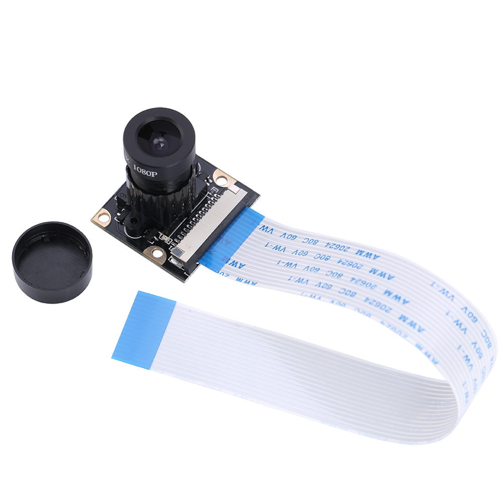

# Camera

The Camera Module is a custom designed add-on for Raspberry Pi. It attaches to Raspberry Pi by way of one of the two small sockets on the board upper surface. This interface uses the dedicated CSI interface, which was designed especially for interfacing to cameras. The CSI bus is capable of extremely high data rates, and it exclusively carries pixel data. Raspberry Pi NOT INCLUDED.

## Features
- Integral IR filter.
- High-Definition video camera for Raspberry Pi Model A or B.
- The sensor in a fixed-focus module with replaceable lense.
- The sensor itself has a native resolution of 5 megapixel, and has a fixed focus lens on board.
- Connection by flat ribbon cable to 15-pin MIPI Camera Serial Interface (CSI) connector S5 on Raspberry Pi computer board.

## Specification
- Lens holder: M12x0.5 or CS Mount
- Pixels: 5MPixel sensor
- Still Picture Resolution: 2592 x 1944
- Max Video Resolution: 1080p
- Max Frame Rate: 30fps
- Size: 2.5 x 2.5 x 2.6cm / 0.98 x 0.98 x 1.02inch
- Cable Length: 15cm / 5.9inch
- Package Weight: 20g
- Quantity: 1pc
- Fitments: For Raspberry Pi 3

## Download
http://www.arducam.com/downloads/modules/RaspberryPi_camera/RaspberryPi_Camera_Module_DS_V3.0.pdf
