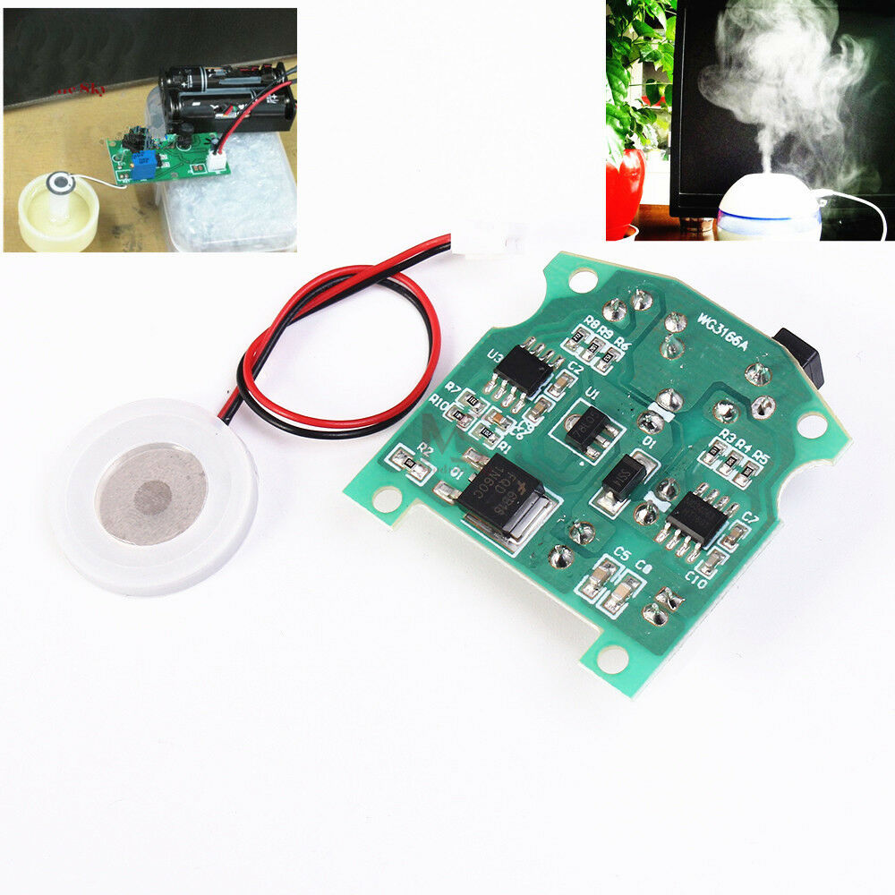

# Ultrasonic Humidifier

## Specification：
- Diameter:20mm 
- Operating Voltage:3.7-12V 
- Frequency:113+/-3KHz 
- Quiescent Capacitor:3000+/-15%PF 
- Rated Voltage:70V (max) 
- Rated Power:2.5W (normal use 1.5W) 
