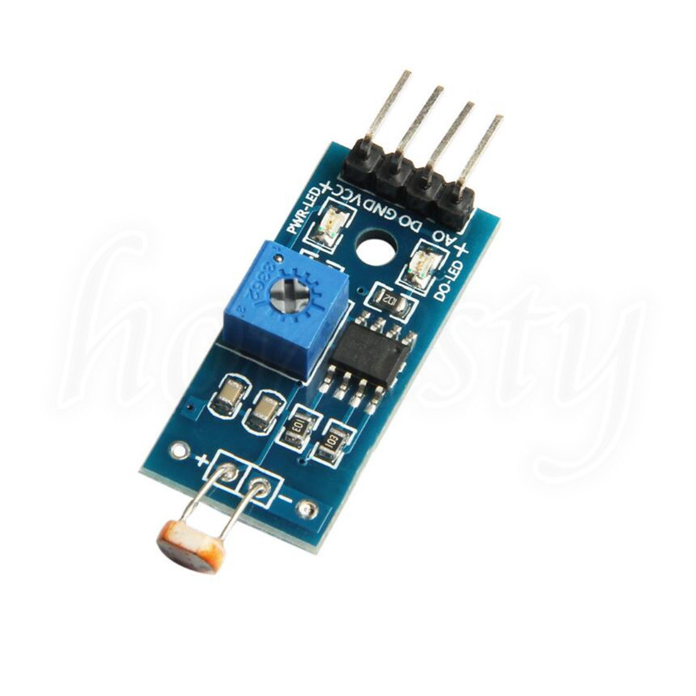

# Light Intensity Sensor 

## Feature
1. using the sensitive type photosensitive resistance sensor
2. the comparator output signal clean waveform is good, driving ability, than 15mA.
3. with adjustable potentiometer can adjust the brightness of the light detected
4. working voltage 3.3V-5V
5. the output format: Digital switching output (0 and 1)
6. with bolt holes for easy installation
7. a small board PCB size: 3.2cm x 1.4cm
Conversions:1cm=0.03937 inch,1 inch= 2.54cm
8. using a wide voltage LM393 comparator

## Module for use
1. the photosensitive resistor module most sensitive to ambient light, generally used to detect the brightness of the ambient light, triggering microcontroller or relay modules;
2. the module brightness of ambient light reach the set threshold, DO-side output high when the ambient light level exceeds the set threshold, DO-ended output low;
3. DO output can be directly connected with the microcontroller through the microcontroller to detect high and low, thereby detecting changes in ambient light intensity;
4. DO OUR outputs can directly drive the relay module, which can be composed of a light control switch.