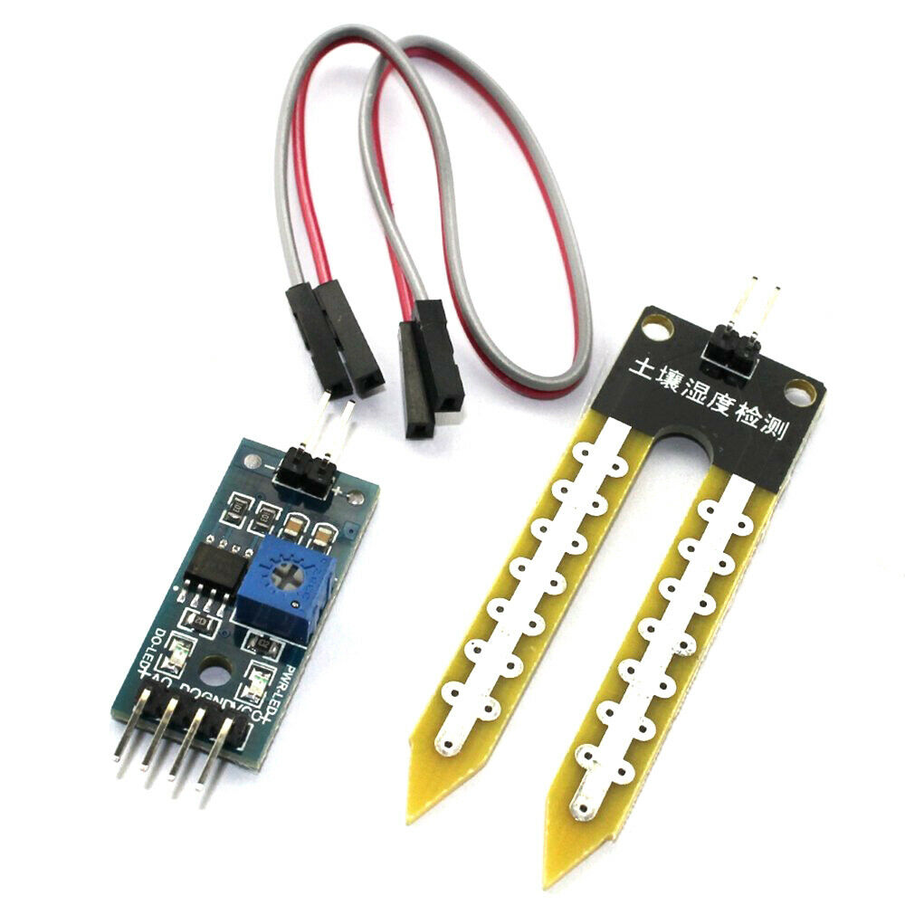

# Soil moisture sensor

This is a summary of the soil moisture sensor can be used to detect moisture, when the soil is dry, the module outputs a high level, whereas output low. Using this sensor make an automatic watering system, so that your garden plants without people to manage.

## Specification：
- Operating voltage: 3.3V~5V.
- Adjustable sensitivity (shown in blue digital potentiometer adjustment)
- Dual output mode,analog output more accurate.
- A fixed bolt hole for easy installation.
- With power indicator (red) and digital switching output indicator (green).
- Having LM393 comparator chip, stable.
- Panel PCB Dimension: 3cm x 1.5cm.
- Soil Probe Dimension: 6cm x 2cm.
- Cable Length: 21cm.
- VCC: 3.3V-5V.
- GND: GND.
- DO: digital output interface(0 and 1).
- AO: analog output interface.

## How to Use :
1. Soil moisture module is most sensitive to the ambient humidity is generally used to detect the moisture content of the soil.
2. Module to reach the threshold value is set in the soil moisture, DO port output high, when the the soil humidity exceeds a set threshold value, the module D0 output low.
3. The digital output D0 can be connected directly with the microcontroller to detect high and low by the microcontroller to detect soil moisture.
4. The digital outputs DO shop relay module can directly drive the buzzer module, which can form a soil moisture alarm equipment.
5. Analog output AO and AD module connected through the AD converter, you can get more precise values of soil moisture.

