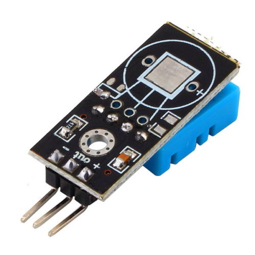

# DHT11 Temperature and Humidity Sensor Module 

This sensor module utilizes DHT11 as the sensitive component and has a bypass capacitor and a pull-up resistor on-board. The DHT11 is a pre-calibrated digital output temperature and humidity sensor. The single-wire wiring scheme makes it easy to be integrated to other applications. The simple communication protocol greatly reduces the programming effort required.

## Specification:
- Power supply voltage: 3.3~5.5V DC
- Output: the single bus digital signal
- Measuring range: 20-90%RH humidity, temperature 0~50°
- The measurement accuracy of +-5%RH: humidity, temperature +-2 °
- Resolution: 1%RH humidity, temperature 1 °
- Exchangeability: fully interchangeable
- Long term stability: < ± 1%RH
- Size: 28 * 12 * 7.2mm

## Interface Description:
1. VCC:External 3.3 V-5 V 
2. GND:External GND
3. DO:Small board switch digital output interface, connect the microcontroller IO port
